# Beatrix Chis Hunyadi

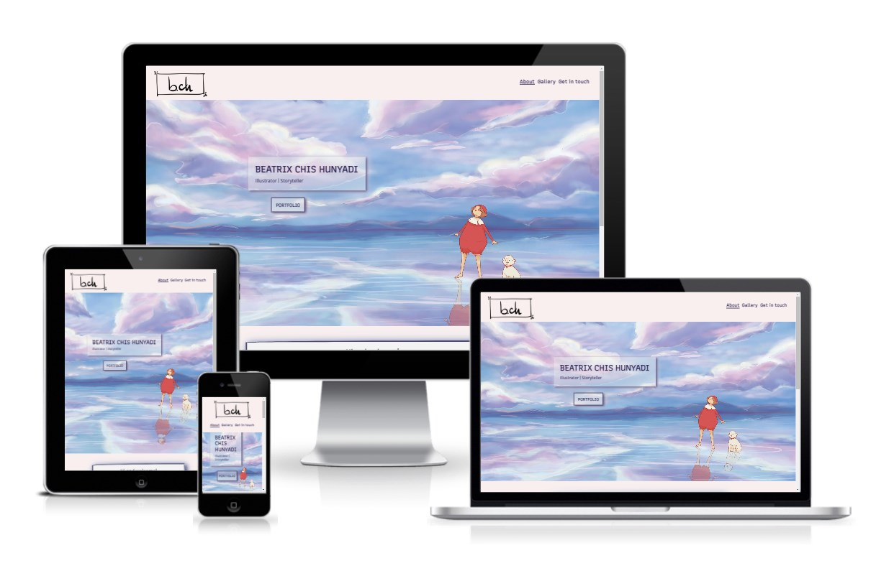
### [**Portfolio Website**](https://noemichis.github.io/beatrix-ch-portfoliowebsite/)

This project is a portfolio website for illustrator, Beatrix Chis Hunyadi. The main purpose is to create an online presence for the artist and showcase her work. The site will target anyone interested in digital art and illustration, future collaborators, employers. It is a responsive design and it can be viewed on different sized devices.

## User goals 
- Understand the purpose of the site immediately.
- Become more familiar with the artist and her work.
- Navigate easily between sections and pages.
- Enjoy the diversity and creativity.
- Get in touch easily.

## Design

The design is based on the work of Beatrix and the colors were chosen with the help of [Coolors](https://coolors.co). I found this a great tool to identify combinations of colors used in an image, which afterwards can be used on other elements to create consistency.

- The combination obtained is the following:

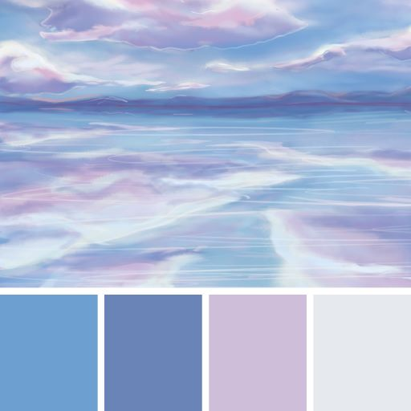

- After considering the contrast, the following color palette was chosen with addition of a darker purple for text and reduced opacity when used as a container.  

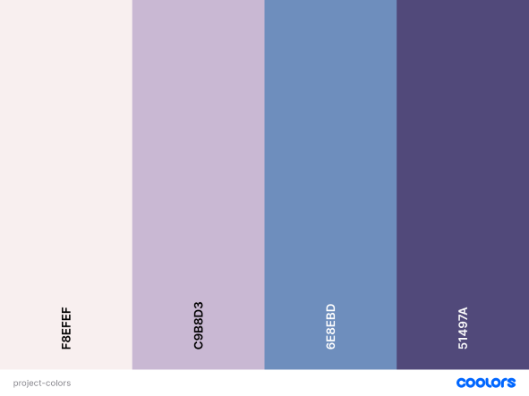

The fonts were matched in [Google Fonts](http://fonts.google.com) and imported. `Recursive` is used for the larger headings and navbar, while `Merriweather Sans` for smaller headings and paragraphs. 

## Features

### Navigation
- The navigation bar is part of the header and it stays at the top of the page, offering better accessibility for the user at all times.
- On the left, the logo creates a link to the landing page. 
- On the right, the navigation links lead to the `About` section, `Gallery` and `Get in touch` pages.
- Navigation elements scale up on hover, improving user experience.
- An active class is set so the current page is underlined.  

#### Navigation on larger screens
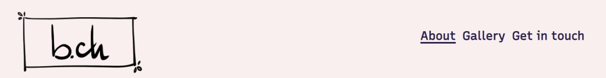 
#### Navigation on mobile
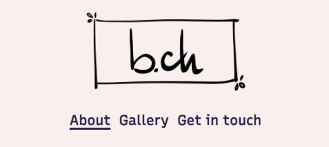

### Hero section
The Hero section is the landing page of the website containing one of the illustrations of Beatrix, her name and a link that leads to the Gallery page.

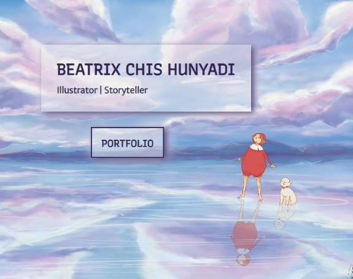

- Scale up hover effect is added to the `Portfolio` link and styled to appear as a box.

### About

Contains a short introduction of the artist under the Hero section.
- The `About` navigation hyperlink leads to the beginning of the section.

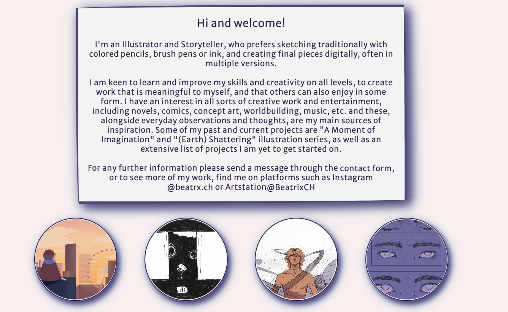 

- *Social media* and *contact form* are links, are highlighted on hover and can be clicked.

- Responsive image links to gallery and specific projects with scale up hover effect.

#### Image links on mobile
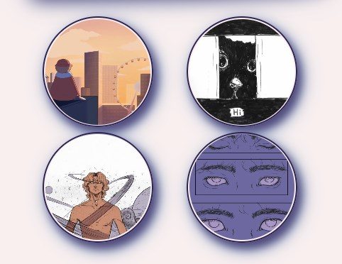

### Footer

The footer contains links to social media platforms, which open in a new tab.

- Two different styles were used for the footer: 

- one is used on the main page using the same pattern as the Hero image.
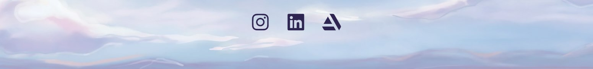   
- one is matching the header and is used on the Gallery and Get in touch pages.
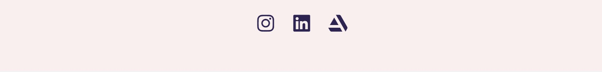 

### Gallery

A showcase containing some of the artist's bigger projects and sketches organized in a responsive grid.

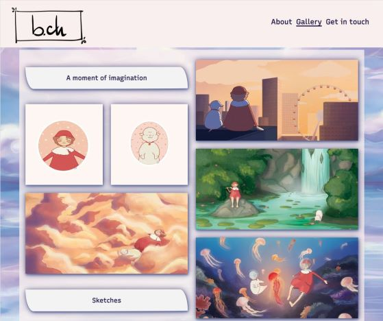

- There are multiple ways to navigate to this page as contains what users would be looking for:
    - `Gallery` navigation link in Header
    - `Portfolio`
    - image links from About section that lead to the exact project

- The background is following the pattern of the Hero image, while the header and footer stay neutral

### Get in touch

The Get in touch Page is a simple contact form where users can send their enquiries and thoughts to the artist.
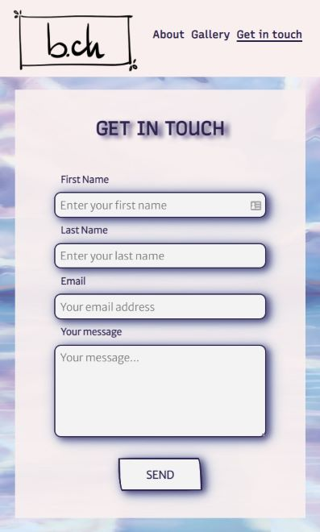

- This page can easily be accessed through:
    - the `Get in touch` navigation link. 
    - the *contact form* mention included in the message from the About page.
     
- The form requires the selected fields to be completed before submitting. 
- The body background uses the same image as the Gallery page, while the form background matches the neutral header and footer. 

## Features to add in the future

- The Gallery page would benefit from an additional navigation element to make viewing projects more efficient. The idea would be similar to the image links used on the About page, with much smaller cards and styled differently. 
- Make images so they can be viewed enlarged when clicked
- Create own *Thank You* page  

## Testing

## Deployment

This project was developed and deployed through [GitHub](https://github.com), using [Gitpod](https://gitpod.io) as development platform and [VSCode](https://code.visualstudio.com/) as the default code editor. 

The following *`git commands`* were used to commit and push the changes to the repository: 
- **git status** - list changes to files
- **git add** - add modified files to staging  area
- **git commit** - explain changes made to files
- **git push**  - push all files from staging area to main [GitHub](https://github.com) repository

[GitHub Pages](https://pages.github.com/) was used to deploy the project with the following steps:
1. Log into [GitHub](https://github.com) and open project repository
3. Navigate to `Settings`
4. Find and click on `Pages` in the left-hand side menu
5. Under `Source` select `Deploy from branch` 
6. Click the dropdown menu under `Branch` and select `main` and **Save**
8. Refresh the page and find link to deployed project at the top

## Technology used

- [HTML5](https://en.wikipedia.org/wiki/HTML5)
- [CSS](https://en.wikipedia.org/wiki/CSS)
- [Github](https://github.com) - create, develop and deploy project
- [Gitpod](https://gitpod.io) - used as remote development platform to write and test code
- [Google Fonts](http://fonts.google.com) - online font library 
- [Coolors](https://coolors.co) - color palette generator used to identify the colors of the hero image and create a matching combination
- [Fontawesome](https://fontawesome.com) - online icon library and toolkit for the social media section
- [Chrome Dev Tools](https://developer.chrome.com/docs/devtools) - great tool for checking responsiveness on different screen sizes, making test changes and troubleshooting 
- [Figma](https://www.figma.com) - design tool 
- [Online Converter](https://www.online-convert.com/) - convert .jpeg and .png images to .webp for better site accessibility
- [Favicon](https://favicon.io/) -generate favicon used in head of page

## Credits
#### All images across the site are designed and created by **Beatrix Chis-Hunyadi**, including the logo and favicon. 

Several learning sites were visited throughout the development of the project, as:
- [W3Schools](https://www.w3schools.com)
- [MDN](https://developer.mozilla.org/en-US/) 
- [CSS-tricks](https://css-tricks) 
- [Stack Overflow](https://stackoverflow.com/)

Found great inspiration and help in learning `CSS` tips and tricks, including `flexbox` and `grid` by following [Kevin Powell](https://www.youtube.com/@KevinPowell/featured)'s channel

[CodePen](https://codepen.io) was very useful to see some more complex styling possibilities - inspiration for `border-radius` by [Michael Picker](https://codepen.io/mp/pen/kBEeKw)

